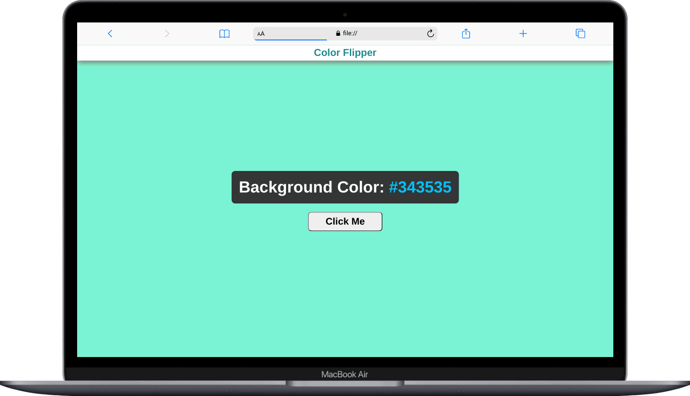

# Color Flipper

# Technologies used
- HTML
- CSS
- JavaScript

# How it works
When we click on the `Click Me` button, a random color is generated that would be applied in the body background and the test of the color assigined will also be displayed in the page.